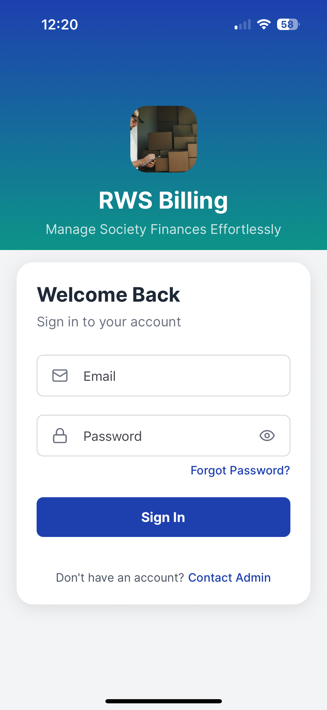
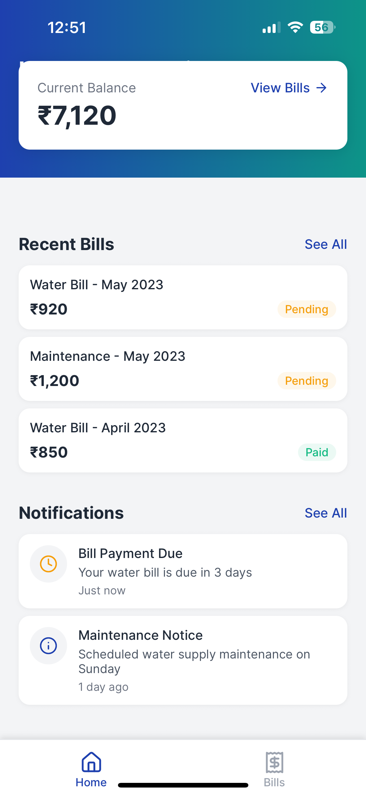
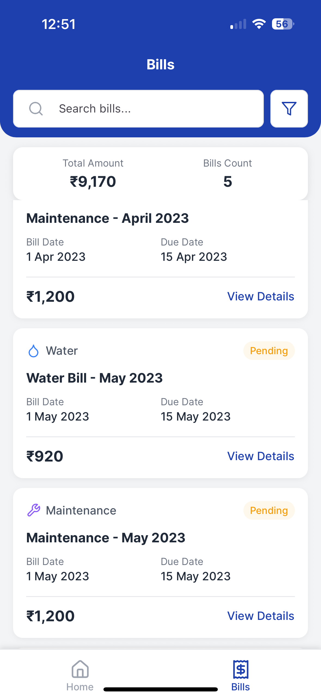
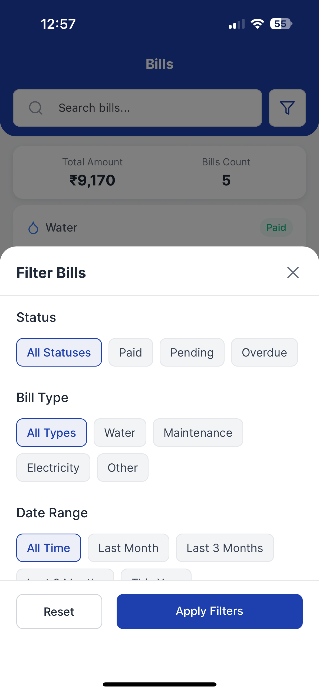
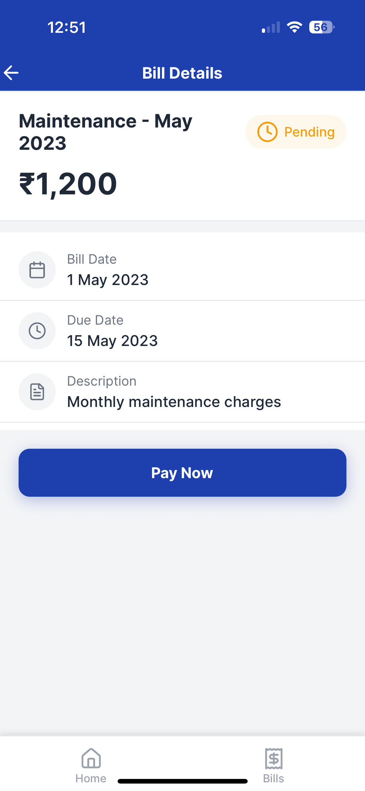
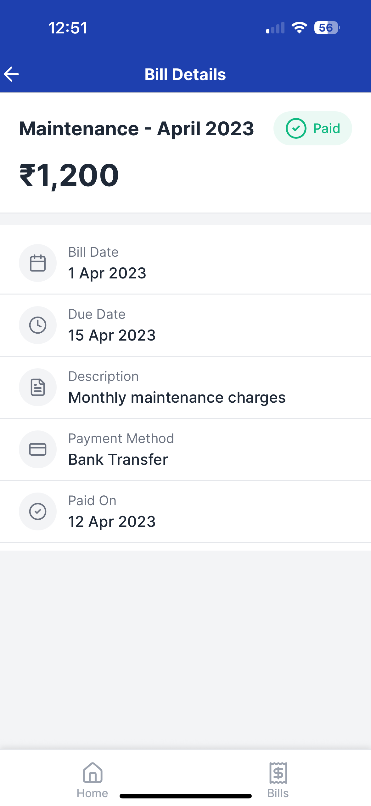
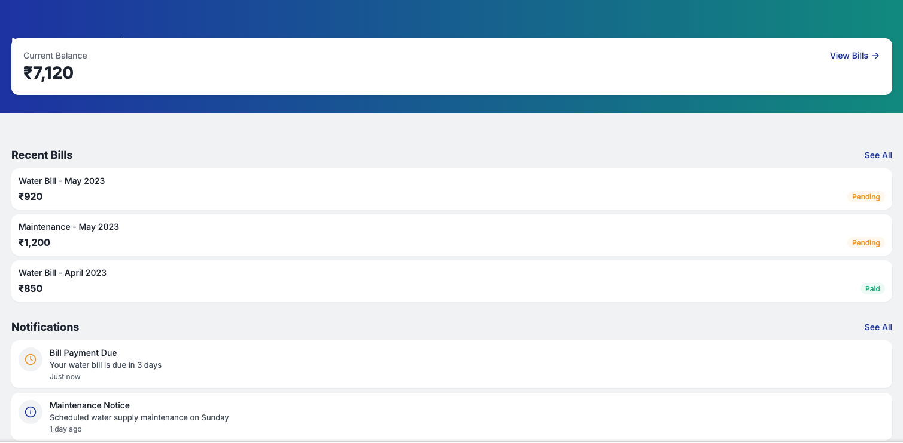

# RWS Billing System

A modern, web-based residential water and maintenance billing system built with Expo and React Native.

## Screenshots

### Mobile App

<div style="display: flex; gap: 20px; margin-bottom: 20px;">
  
  
  
  
  
  
</div>

### Web Dashboard



## Tech Stack

- **Framework**: Expo 53
- **UI Components**: React Native Paper
- **Navigation**: Expo Router
- **Icons**: Lucide React Native
- **Authentication**: Custom auth system
- **State Management**: React Context
- **Storage**: AsyncStorage
- **Styling**: React Native StyleSheet

## Getting Started

### Prerequisites

- Node.js 18 or higher
- npm or yarn
- Expo CLI

### Installation

1. Clone the repository:
```bash
git clone https://github.com/yourusername/rws-billing-system.git
```

2. Install dependencies:
```bash
cd rws-billing-system
npm install
```

3. Start the development server:
```bash
npm run dev
```

### Demo Credentials

- **Admin Account**
  - Email: admin@example.com
  - Password: admin123

- **Resident Account**
  - Email: resident@example.com
  - Password: resident123

## Project Structure

```
rws-billing-system/
├── app/                    # Application routes
│   ├── (tabs)/            # Tab-based navigation
│   ├── auth/              # Authentication screens
│   └── _layout.tsx        # Root layout
├── components/            # Reusable components
│   ├── bills/            # Bill-related components
│   ├── notifications/    # Notification components
│   └── ui/               # UI components
├── constants/            # App constants
├── context/              # React Context providers
├── hooks/               # Custom hooks
├── services/            # API services
└── utils/               # Utility functions
```

## Contributing

1. Fork the repository
2. Create your feature branch (`git checkout -b feature/AmazingFeature`)
3. Commit your changes (`git commit -m 'Add some AmazingFeature'`)
4. Push to the branch (`git push origin feature/AmazingFeature`)
5. Open a Pull Request

## License

This project is licensed under the MIT License - see the [LICENSE](LICENSE) file for details.

## Acknowledgments

- [Expo](https://expo.dev/)
- [React Native](https://reactnative.dev/)
- [React Native Paper](https://callstack.github.io/react-native-paper/)
- [Lucide Icons](https://lucide.dev/)